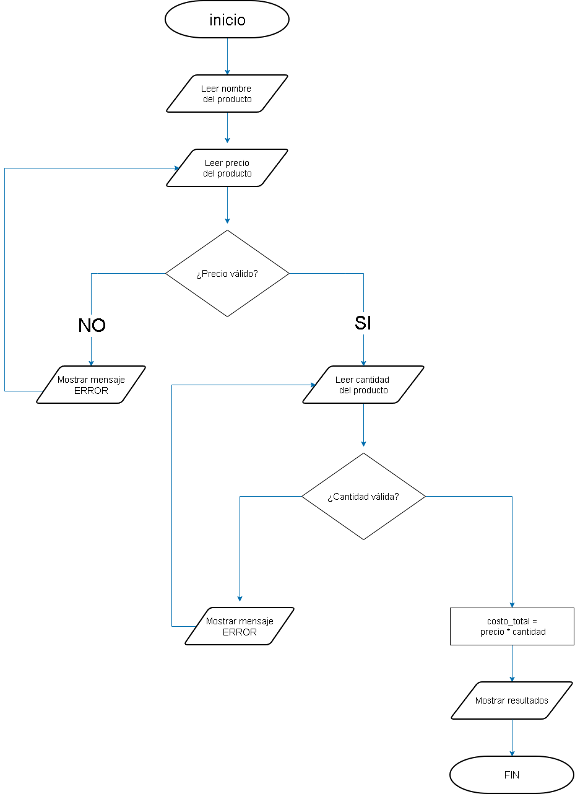

# Programa Simple de Inventario

## Descripción
Este proyecto es un programa simple de inventario escrito en Python. Permite calcular el costo total de un producto utilizando el precio y la cantidad ingresados por el usuario.

El programa está diseñado para practicar conceptos básicos de Python como:
- Variables
- Entrada de datos (`input`)
- Operaciones matemáticas
- Mostrar información en pantalla (`print`)

---

## Cómo funciona
1. El programa solicita al usuario el nombre del producto.
2. Luego pide el precio del producto.
3. Después solicita la cantidad.
4. El programa calcula el costo total multiplicando el precio por la cantidad.
5. Finalmente muestra en pantalla la información del producto y el costo total.

---

## Diagrama de flujo



# Cómo abrir y ejecutar el proyecto

## 1. Instalar los requisitos
Antes de ejecutar el programa asegúrate de tener instalado:

- Python 3
- Git

Puedes verificarlo con los siguientes comandos:

```bash
python --version
git --version
```

---

## 2. Clonar el repositorio desde GitHub
Abre la terminal o consola y ejecuta el siguiente comando:

```bash
https://github.com/Keinerdmb/Proyecto_inventario_pyhton.git
```

Esto descargará el proyecto en tu computadora.

---

## 3. Entrar a la carpeta del proyecto
Después de clonar el repositorio, entra a la carpeta con:

```bash
cd Ruta-basica
```

---

## 4. Verificar que el archivo exista
Puedes comprobar que el archivo esté en la carpeta usando:

```bash
ls
```

Deberías ver el archivo:

```
inventario.py
```

---

## 5. Ejecutar el programa
Para ejecutar el programa escribe:

```bash
python3 inventario.py
```

---

## 6. Ingresar los datos
El programa te pedirá:

- Nombre del producto
- Precio del producto
- Cantidad

Después mostrará un resúmen del producto y el **costo total**.

---

## Ejemplo de uso

```
Ingrese el nombre del producto: Laptop
Ingrese el precio: 800
Ingrese la cantidad: 2

Producto: Laptop
Precio: 800
Cantidad: 2
Costo total: 1600
```

---

## Estado del proyecto
El programa actualmente funciona correctamente y calcula el costo total de los productos.
